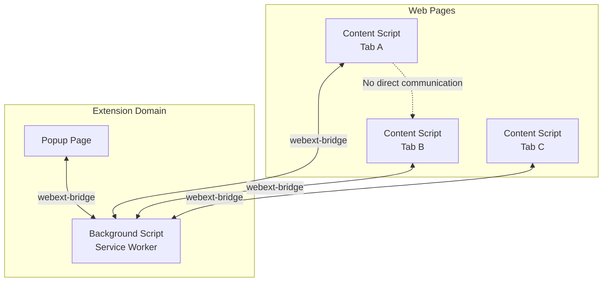
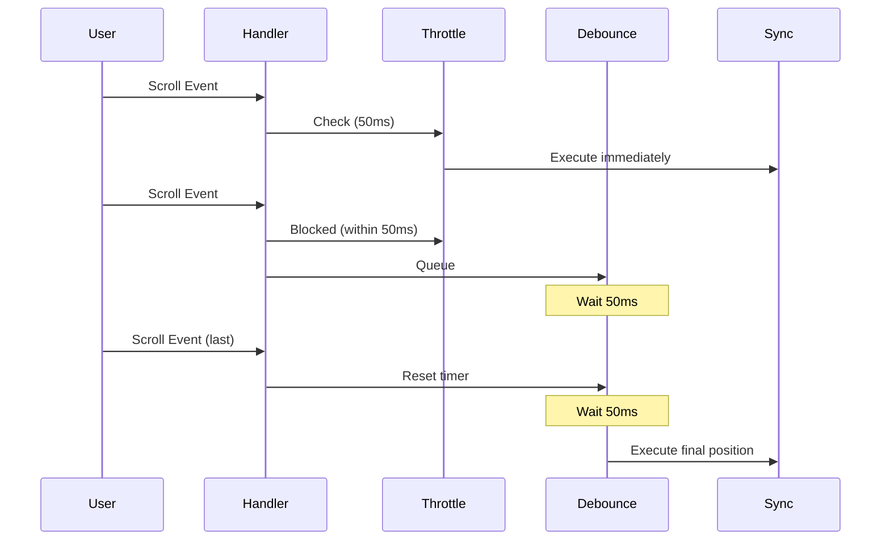
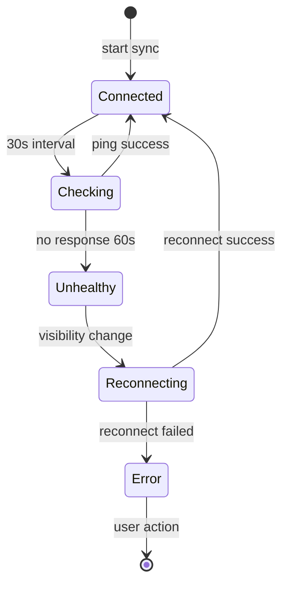

# Contributing Guide

Thank you for your interest in contributing to Synchronize Tab Scrolling! This guide provides technical details for developers who want to contribute to the project.

[한국어](#한국어-가이드)

---

## Table of Contents

- [Getting Started](#getting-started)
- [Project Structure](#project-structure)
- [Architecture](#architecture)
- [Tech Stack](#tech-stack)
- [Development Commands](#development-commands)
- [Code Conventions](#code-conventions)
- [Pull Request Guidelines](#pull-request-guidelines)

---

## Getting Started

### Prerequisites

- **Node.js**: v18+ (v20+ recommended)
- **pnpm**: v9+
- **Git**: Latest version

### Setup

```bash
# Clone the repository
git clone https://github.com/jaem1n207/synchronize-tab-scrolling.git
cd synchronize-tab-scrolling

# Install dependencies
pnpm install

# Start development server
pnpm dev          # Chrome/Edge/Brave
pnpm dev-firefox  # Firefox
```

### Loading the Extension

**Chrome/Edge/Brave:**
1. Navigate to `chrome://extensions` (or `edge://extensions`)
2. Enable "Developer mode"
3. Click "Load unpacked"
4. Select the `extension` folder

**Firefox:**
1. Navigate to `about:debugging#/runtime/this-firefox`
2. Click "Load Temporary Add-on"
3. Select any file in the `extension` folder

---

## Project Structure

```
synchronize-tab-scrolling/
├── src/
│   ├── background/           # Background script (service worker)
│   │   └── main.ts          # Message hub, tab management
│   ├── contentScripts/       # Content scripts injected into pages
│   │   ├── index.ts         # Entry point
│   │   ├── scrollSync.ts    # Scroll synchronization logic
│   │   ├── urlSync.ts       # URL navigation sync
│   │   └── components/      # Control panel UI (React)
│   ├── popup/               # Popup UI (React)
│   │   ├── components/      # Tab selection, sync controls
│   │   └── App.tsx          # Main popup component
│   ├── shared/              # Shared utilities
│   │   ├── lib/            # Utility functions
│   │   ├── types/          # TypeScript definitions
│   │   └── components/     # Shared UI components
│   └── manifest.ts          # Dynamic manifest generation
├── extension/               # Build output
├── scripts/                 # Build scripts
└── _locales/               # i18n translations
```

---

## Architecture

### Message Flow

The extension uses a hub-and-spoke architecture where the background script acts as the central message hub.



**Key Messages:**

| Message | Direction | Purpose |
|---------|-----------|---------|
| `scroll:start` | Background → Content | Initialize sync with tab IDs |
| `scroll:stop` | Background → Content | Stop sync and cleanup |
| `scroll:sync` | Content → Background → Content | Broadcast scroll position |
| `scroll:manual` | Content → Background → Content | Toggle manual adjustment mode |
| `url:sync` | Content → Background → Content | Broadcast URL changes |
| `sync:status` | Background → Content | Update linked tabs info |

### Synchronization Algorithms

**Ratio-Based Sync (Default):**

```typescript
// Calculate scroll ratio (0-1)
const ratio = scrollTop / (scrollHeight - clientHeight);

// Apply to target tab
const targetScrollTop = ratio * (targetScrollHeight - targetClientHeight);
```

**Element-Based Sync (Alternative):**

1. Extract semantic elements (h1-h6, article, section, p)
2. Find nearest element to current scroll position
3. Match element index across tabs
4. Scroll to matched element with position offset

### Throttle + Debounce Strategy



### Connection Health & Recovery



---

## Tech Stack

| Category | Technology |
|----------|------------|
| **Framework** | React 19, TypeScript |
| **Build Tool** | Vite with HMR |
| **Styling** | UnoCSS + Tailwind + shadcn/ui |
| **State** | React Query (@tanstack/react-query) |
| **Extension API** | webextension-polyfill |
| **Messaging** | webext-bridge |
| **Animations** | Framer Motion |
| **Icons** | unplugin-icons |

### Browser Support

| Browser | Manifest | Background |
|---------|----------|------------|
| Chrome | V3 | Service Worker |
| Edge | V3 | Service Worker |
| Brave | V3 | Service Worker |
| Firefox | V3 | Background Script |

---

## Development Commands

| Command | Description |
|---------|-------------|
| `pnpm dev` | Start dev server (Chrome/Edge/Brave) |
| `pnpm dev-firefox` | Start dev server (Firefox) |
| `pnpm build` | Production build |
| `pnpm typecheck` | TypeScript type checking |
| `pnpm lint:fix` | Lint and auto-fix |
| `pnpm format:fix` | Format with Prettier |
| `pnpm test` | Run test suite |
| `pnpm pack` | Package for distribution (.zip, .crx, .xpi) |
| `pnpm start:chromium` | Launch in Chrome/Edge/Brave |
| `pnpm start:firefox` | Launch in Firefox |

---

## Code Conventions

### File Naming
- **Files/Folders**: kebab-case (`scroll-sync.ts`)
- **Components**: PascalCase (`SyncControlPanel.tsx`)
- **Types**: PascalCase with descriptive names

### TypeScript
- Prefer `interface` over `type` for object shapes
- Use Union Types over `enum`
- Avoid `any` and type assertions (`as`)

### Commit Messages

Follow [Conventional Commits](https://www.conventionalcommits.org/):

```
feat: add URL navigation sync
fix: resolve cross-domain scroll issue
docs: update README with new features
refactor: simplify message handling
```

### Testing
- Write tests for core business logic
- Use Vitest for unit tests
- Use Playwright for E2E tests

---

## Pull Request Guidelines

1. **Fork** the repository
2. **Create** a feature branch: `git checkout -b feature/amazing-feature`
3. **Make** changes and run tests: `pnpm test`
4. **Run** linting: `pnpm lint:fix`
5. **Commit** with Conventional Commits format
6. **Push** and open a Pull Request

### PR Checklist

- [ ] Code follows existing patterns
- [ ] Tests added/updated if needed
- [ ] TypeScript types are complete
- [ ] No lint errors
- [ ] Commit messages follow convention

---

## Troubleshooting

For detailed troubleshooting information, see [TROUBLESHOOTING.md](./TROUBLESHOOTING.md).

---

# 한국어 가이드

## 시작하기

### 사전 요구사항

- **Node.js**: v18 이상 (v20 이상 권장)
- **pnpm**: v9 이상
- **Git**: 최신 버전

### 설정

```bash
# 저장소 클론
git clone https://github.com/jaem1n207/synchronize-tab-scrolling.git
cd synchronize-tab-scrolling

# 의존성 설치
pnpm install

# 개발 서버 시작
pnpm dev          # Chrome/Edge/Brave
pnpm dev-firefox  # Firefox
```

### 확장 프로그램 로드

**Chrome/Edge/Brave:**
1. `chrome://extensions` (또는 `edge://extensions`) 접속
2. "개발자 모드" 활성화
3. "압축해제된 확장 프로그램을 로드합니다" 클릭
4. `extension` 폴더 선택

**Firefox:**
1. `about:debugging#/runtime/this-firefox` 접속
2. "임시 부가 기능 로드" 클릭
3. `extension` 폴더 내 아무 파일 선택

---

## 코드 컨벤션

### 파일 명명
- **파일/폴더**: kebab-case (`scroll-sync.ts`)
- **컴포넌트**: PascalCase (`SyncControlPanel.tsx`)

### TypeScript
- 객체 형태는 `type`보다 `interface` 선호
- `enum`보다 Union Types 사용
- `any`와 타입 단언(`as`) 지양

### 커밋 메시지

[Conventional Commits](https://www.conventionalcommits.org/) 형식:

```
feat: URL 네비게이션 동기화 추가
fix: 크로스도메인 스크롤 이슈 해결
docs: README 업데이트
refactor: 메시지 처리 단순화
```

---

## Pull Request 가이드라인

1. 저장소 **포크**
2. 기능 브랜치 **생성**: `git checkout -b feature/amazing-feature`
3. 변경 후 테스트 **실행**: `pnpm test`
4. 린트 **실행**: `pnpm lint:fix`
5. Conventional Commits 형식으로 **커밋**
6. **푸시** 후 Pull Request 생성

### PR 체크리스트

- [ ] 기존 패턴을 따름
- [ ] 필요시 테스트 추가/업데이트
- [ ] TypeScript 타입 완전함
- [ ] 린트 오류 없음
- [ ] 커밋 메시지 컨벤션 준수
