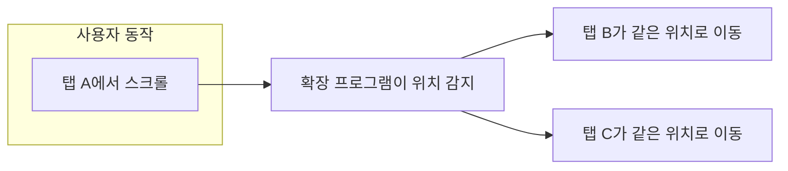
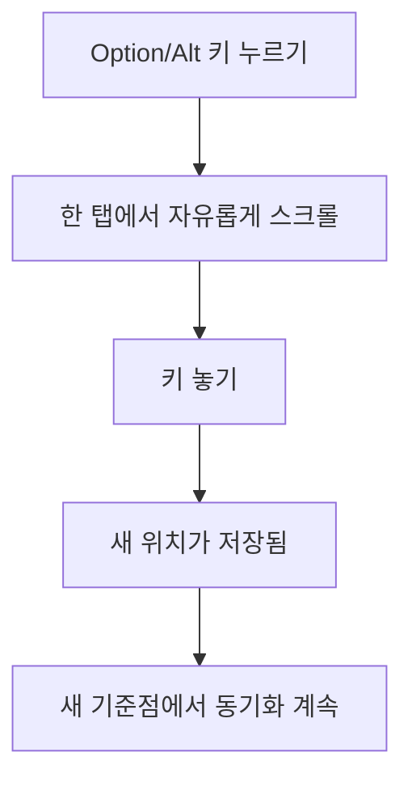
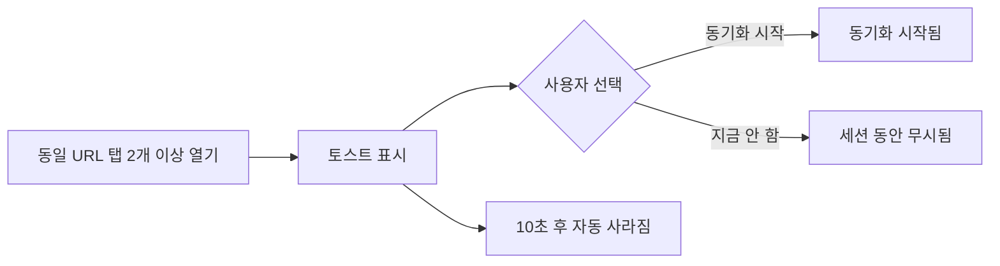
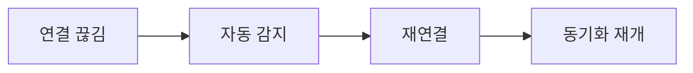

  

<h1 align="center">Synchronize Tab Scrolling</h1>

  <strong>한 번 스크롤하면, 모든 탭이 함께 움직입니다.</strong> 
  여러 탭의 스크롤을 동시에 맞춰주는 브라우저 확장 프로그램이에요.

  
  
  
  

  
  

  <a href="./README.md">ENGLISH</a> | 한국어

---

## 이게 뭔가요?

두 문서를 나란히 놓고 읽을 때(ex: 원문과 번역문) 스크롤을 맞추는 게 번거로웠죠? 이 확장 프로그램이 그 문제를 해결해 줘요.

**한 탭에서 스크롤하면, 연결된 모든 탭이 같은 위치로 자동으로 따라와요.**

---

## 사용 영상

---

## 사용 방법

### 1단계: 설치

위의 브라우저 배지 중 하나를 클릭해서 각 브라우저의 확장 프로그램 스토어에서 설치해 주세요.

### 2단계: 탭 열기

탭을 두 개 이상 열어 주세요.

### 3단계: 동기화 시작

1. 브라우저 도구 모음에서 확장 프로그램 아이콘을 클릭해 주세요
2. 동기화할 탭을 선택해 주세요 (체크박스 선택)
3. **"동기화 시작"** 버튼을 클릭해 주세요

### 4단계: 스크롤!

동기화된 탭 중 아무 곳에서나 스크롤해 보세요. 연결된 모든 탭이 자동으로 따라와요.

### 팁: 수동 위치 조정

원문과 번역문처럼 같은 내용이라도 언어에 따라 길이가 달라요—어떤 언어는 간결하게, 어떤 언어는 길게 표현하니까요. 그래서 스크롤하다 보면 읽고 있는 위치가 점점 어긋나기도 해요.

**Option** (Mac) 또는 **Alt** (Windows) 키를 누른 채로 스크롤하면, 다른 탭에 영향을 주지 않고 특정 탭의 위치만 조정할 수 있어요. 키를 놓으면 조정된 위치를 기준으로 동기화가 계속돼요.

### 5단계: 동기화 중지

확장 프로그램 아이콘을 다시 클릭해서 **"동기화 해제"**를 선택하거나, 동기화된 탭을 닫으면 돼요.

---

## 지원되지 않는 페이지

브라우저 보안 제한 때문에 아래 페이지에서는 동기화가 안 돼요:

- 브라우저 내부 페이지 (`chrome://`, `edge://`, `about:`)
- 확장 프로그램 스토어
- Google 서비스 (문서, 드라이브, Gmail, 스프레드시트 등)
- 일부 웹 앱 (Figma, JIRA, Microsoft Office Online, Notion 등)
- 검색 엔진 결과 페이지 (Google 검색, 네이버, Bing, DuckDuckGo 등)
- PDF 파일 및 PDF 뷰어
- 로그인/인증 페이지
- 특수 URL (`view-source:`, `data:`, `file://`)

이런 탭은 선택 목록에서 비활성화돼요.

---

## 누구를 위한 건가요?

- 여러 논문을 동시에 검토할 때
- 코드 버전을 나란히 비교할 때
- 원문과 번역문을 비교할 때
- **여러 문서를 동시에 다루는 모든 분**

---

## 주요 기능

### 실시간 스크롤 동기화

한 탭에서 스크롤하면, 연결된 모든 탭이 같은 위치로 즉시 이동해요.

### 수동 위치 조정

문서의 위치가 완벽하게 맞지 않을 때가 있어요. **Option** (Mac) 또는 **Alt** (Windows) 키를 누른 채로 스크롤하면, 동기화를 유지하면서 개별 탭의 위치를 조정할 수 있어요.

### URL 이동 동기화

한 탭에서 링크를 클릭하면, 연결된 모든 탭이 같은 주소로 함께 이동해요.

### 자동 동기화 제안

동일한 URL을 가진 탭이 여러 개 열리면, 각 탭의 오른쪽 하단에 토스트 알림이 나타나요. 클릭 한 번으로 스크롤 동기화를 시작할 수 있어요.

이 기능은 **기본적으로 활성화**되어 있어요. **작업 메뉴** → **"동일한 URL 동기화 제안"**에서 언제든지 비활성화할 수 있어요.

### 자동 재연결

탭의 연결이 끊어지면(예: 컴퓨터가 절전 모드에서 깨어난 후) 확장 프로그램이 자동으로 다시 연결하고 동기화를 재개해요. 별도의 조작이 필요 없어요.

---

## 지원 언어

확장 프로그램 인터페이스는 **9개 언어**로 제공돼요:

| 언어                | 코드  |
| ------------------- | ----- |
| English (영어)      | en    |
| 한국어              | ko    |
| 日本語 (일본어)     | ja    |
| Français (프랑스어) | fr    |
| Español (스페인어)  | es    |
| Deutsch (독일어)    | de    |
| 중국어 (중국)       | zh_CN |
| 중국어 (대만)       | zh_TW |
| हिन्दी (힌디어)     | hi    |

---

## 개인정보 보호정책

**여러분의 개인정보를 소중히 생각해요.**

- **데이터 수집 없음**: 어떤 개인 정보도 수집하거나 저장하지 않아요
- **분석 없음**: 추적, 쿠키, 원격 측정 없음
- **네트워크 요청 없음**: 확장 프로그램은 완전히 오프라인으로 작동해요
- **오픈 소스**: [모든 코드를 직접 확인](https://github.com/jaem1n207/synchronize-tab-scrolling)할 수 있어요

이 확장 프로그램은 동기화를 위해 명시적으로 선택한 탭에만 접근하며, 모든 데이터는 여러분의 기기에만 저장돼요.

---

## 지원

문제가 있으신가요? 도움을 드릴게요:

- **이메일**: [tech.jmtt@gmail.com](mailto:tech.jmtt@gmail.com)
- **GitHub**: [버그 신고하기](https://github.com/jaem1n207/synchronize-tab-scrolling/issues/new?title=버그%20신고&labels=bug&assignees=jaem1n207)

---

## 기여하기

기여하고 싶으신가요? [Contributing Guide](./CONTRIBUTING.md)에서 개발 환경 설정과 가이드라인을 확인해 주세요.

---

## 라이선스

MIT 라이선스. 자세한 내용은 [LICENSE](./LICENSE) 파일을 확인해 주세요.
