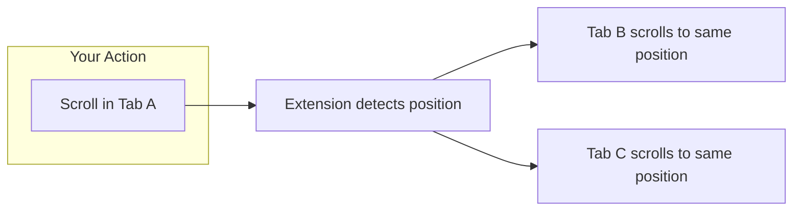
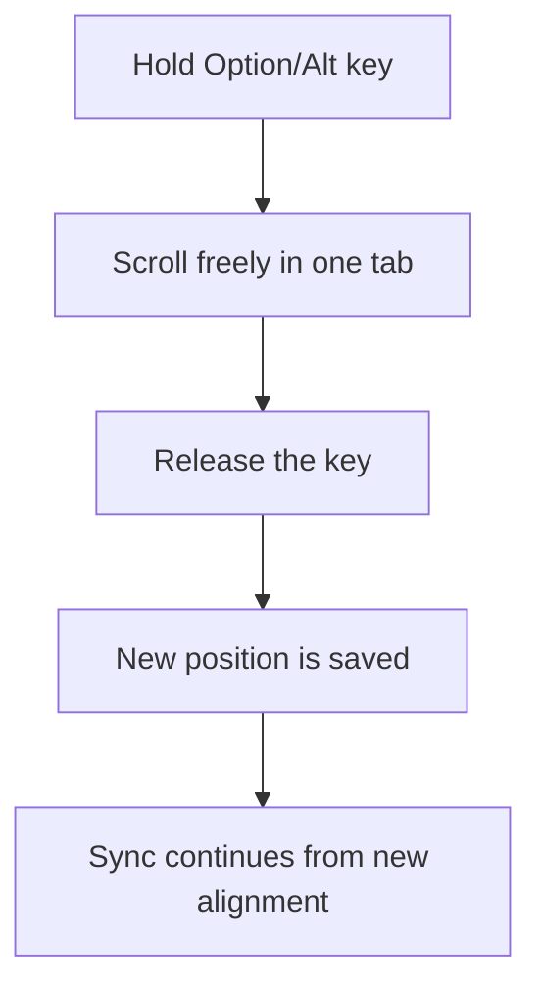
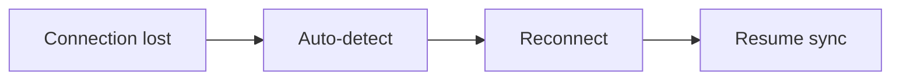

  

<h1 align="center">Synchronize Tab Scrolling</h1>

  <strong>Scroll once, sync everywhere.</strong> 
  A browser extension that keeps multiple tabs scrolling together.

  
  
  
  

  
  

  ENGLISH | <a href="./README-ko_kr.md">한국어</a>

---

## What is this?

When you read two documents side by side—like an original and its translation—scrolling them together can be tedious. This extension solves that problem.

**Scroll in one tab, and all linked tabs scroll to the same position automatically.**

---

## How to Use

### Step 1: Install

Click one of the browser badges above to install from your browser's extension store.

### Step 2: Open tabs

Open two or more tabs with the content you want to compare.

### Step 3: Start syncing

1. Click the extension icon in your browser toolbar
2. Select the tabs you want to sync (check the boxes)
3. Click **"Start Sync"**

### Step 4: Scroll!

Scroll in any synced tab. All linked tabs follow automatically.

### Tip: Manual Position Adjustment

When comparing documents like originals and translations, content lengths often differ due to language characteristics—some languages express the same idea more concisely or verbosely. As you scroll, the reading positions may gradually drift apart.

**Hold Option (Mac) or Alt (Windows)** while scrolling to adjust a specific tab's position without affecting others. Release the key, and sync continues from the new alignment.

### Step 5: Stop syncing

Click the extension icon again and select **"Stop Sync"**, or simply close the synced tabs.

---

## Demo Video

---

## Pages That Don't Work

Due to browser security restrictions, the extension cannot sync these pages:

- Browser internal pages (`chrome://`, `edge://`, `about:`)
- Extension stores
- Google services (Docs, Drive, Gmail, Sheets, etc.)
- Some web apps (Figma, JIRA, Microsoft Office Online, Notion, etc.)
- Special URLs (`view-source:`, `data:`, `file://`)

These tabs will appear disabled in the selection list.

---

## Who is this for?

- reviewing multiple papers simultaneously
- comparing code versions side by side
- comparing original and translated documents
- **Anyone** who works with multiple documents at once

---

## Features

### Real-time Scroll Sync

When you scroll in one tab, all linked tabs move to the same relative position instantly.

### Manual Position Adjustment

Sometimes documents don't line up perfectly. Hold **Option** (Mac) or **Alt** (Windows) while scrolling to adjust individual tabs without breaking the sync.

### Auto-Reconnection

If a tab loses connection (e.g., after your computer sleeps), the extension automatically reconnects and resumes syncing—no manual intervention needed.

### URL Navigation Sync

When you click a link in one tab, all linked tabs navigate to the same URL together.

---

## Supported Languages

The extension interface is available in **9 languages**:

| Language          | Code |
| ----------------- | ---- |
| English           | en   |
| 한국어 (Korean)   | ko   |
| 日本語 (Japanese) | ja   |
| Français (French) | fr   |
| Español (Spanish) | es   |
| Deutsch (German)  | de   |
| 中文 (Chinese)    | zh   |
| हिन्दी (Hindi)    | hi   |

---

## Privacy Policy

**Your privacy matters.**

- **No data collection**: We don't collect, store, or transmit any personal data
- **No analytics**: No tracking, no cookies, no telemetry
- **No network requests**: The extension works entirely offline
- **Open source**: You can [inspect every line of code](https://github.com/jaem1n207/synchronize-tab-scrolling)

This extension only accesses tabs you explicitly select for syncing, and all data stays on your device.

---

## Support

Having issues? We're here to help:

- **Email**: [tech.jmtt@gmail.com](mailto:tech.jmtt@gmail.com)
- **GitHub**: [Report a bug](https://github.com/jaem1n207/synchronize-tab-scrolling/issues/new?title=Bug%20Report&labels=bug&assignees=jaem1n207)

---

## Contributing

Want to contribute? Check out our [Contributing Guide](./CONTRIBUTING.md) for development setup and guidelines.

---

## License

MIT License. See [LICENSE](./LICENSE) for details.
