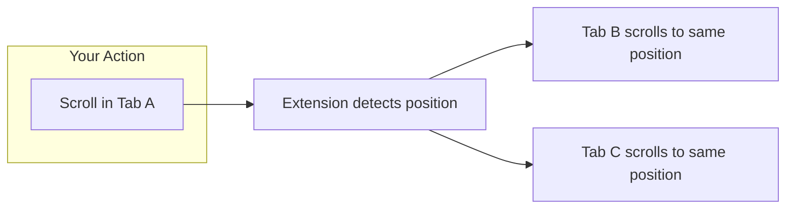
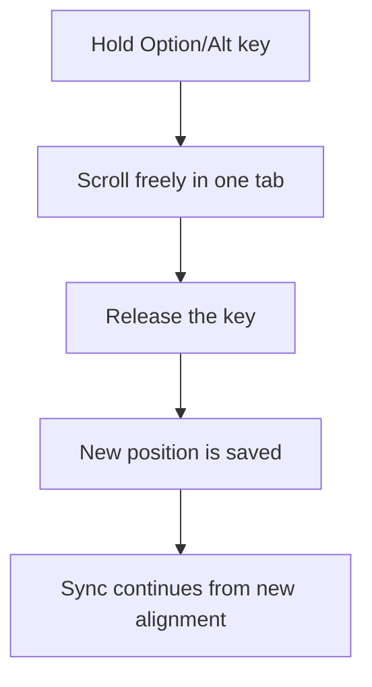
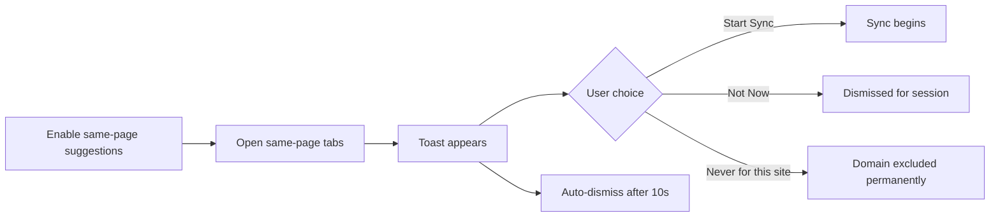
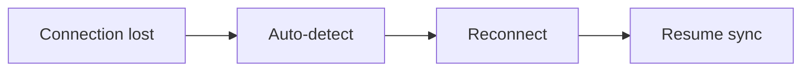

  

<h1 align="center">Synchronize Tab Scrolling</h1>

  <strong>Scroll once, sync everywhere.</strong> 
  A browser extension that keeps multiple tabs scrolling together.

  
  
  
  

  
  

  ENGLISH | <a href="./README-ko_kr.md">한국어</a>

---

## What is this?

When you read two documents side by side—like an original and its translation—scrolling them together can be tedious. This extension solves that problem.

**Scroll in one tab, and all linked tabs scroll to the same position automatically.**

---

## Demo Video

---

## How to Use

### Step 1: Install

Click one of the browser badges above to install from your browser's extension store.

### Step 2: Open tabs

Open two or more tabs with the content you want to compare.

**Local files:** Browser-readable local files opened with `file://` can be synced manually, such
as generated HTML reports, Markdown, JSON, text, CSV, and log files. In Chromium browsers, enable
**"Allow access to file URLs"** for this extension if the popup asks you to.

Local files are manual-sync only; auto-sync suggestions intentionally do not group `file://` tabs.
PDF and Word files remain unsupported.

### Step 3: Start syncing

1. Click the extension icon in your browser toolbar
2. Select the tabs you want to sync (check the boxes)
3. Click **"Start Sync"**

### Step 4: Scroll!

Scroll in any synced tab. All linked tabs follow automatically.

Pages such as MDN can define CSS smooth scrolling for in-page navigation. Synchronize Tab Scrolling
bypasses that animation only for extension-driven sync updates, so linked tabs jump to the latest
matching position instead of slowly replaying old scroll targets. Normal page scrolling and anchor
navigation stay untouched.

### Tip: Manual Position Adjustment

When comparing documents like originals and translations, content lengths often differ due to language characteristics—some languages express the same idea more concisely or verbosely. As you scroll, the reading positions may gradually drift apart.

**Hold Option (Mac) or Alt (Windows)** while scrolling to adjust a specific tab's position without affecting others. Release the key, and sync continues from the new alignment.

After you release the key, the extension keeps the signed pixel distance from that manually aligned
point. This helps figures, captions, and nearby paragraphs stay visually aligned even when the two
pages have different headers, tables of contents, ads, or translation lengths.

### Step 5: Stop syncing

Click the extension icon again and select **"Stop Sync"**, or simply close the synced tabs.

---

## Pages That Don't Work

Most regular `http(s)` pages and browser-readable `file://` documents can be selected. Some tabs are
unavailable because browsers block extension access, the page cannot accept a content script, or the
extension intentionally avoids noisy or private contexts:

- Browser/internal/extension pages (`chrome://`, `edge://`, `about:`, `devtools://`,
  `chrome-extension://`, `moz-extension://`)
- Browser extension stores (Chrome Web Store, Edge Add-ons, Firefox Add-ons)
- Google Workspace, account, and console services (Docs, Drive, Gmail, Sheets, Slides, Calendar,
  Meet, Photos, Accounts, Cloud Console, etc.)
- Search result pages (Google Search, Naver Search, Bing, DuckDuckGo, Yahoo, Baidu, Daum, etc.)
- Known incompatible app surfaces (Figma, Notion, YouTube Music, Atlassian Jira/Confluence)
- PDF files and PDF viewer routes, including local `.pdf` files
- Local Word documents (`file://` `.doc` / `.docx`)
- Login/authentication pages, including common `login.`, `auth.`, `sso.`, `/login`, `/auth`, and
  `/oauth` patterns
- Special URL schemes (`view-source:`, `data:`, `blob:`, `filesystem:`, `javascript:`,
  `vbscript:`, `ftp:`, `ws:`, `wss:`)

These tabs appear disabled in the selection list. Browser-readable local files are the exception:
they can be selected for manual sync when file URL access is allowed. In Chromium browsers, if file
access is off, the popup shows a settings action so you can enable **"Allow access to file URLs"**.

---

## Who is this for?

- reviewing multiple papers simultaneously
- comparing code versions side by side
- comparing original and translated documents
- **Anyone** who works with multiple documents at once

---

## Features

### Real-time Scroll Sync

When you scroll in one tab, all linked tabs move to the same relative position instantly.
This remains true on pages that use CSS `scroll-behavior: smooth`; extension-driven sync updates are
applied immediately without disabling the page's own smooth scrolling behavior.

```mermaid
flowchart LR
    subgraph You["Your Action"]
        A[Scroll in Tab A]
    end

    A --> B[Extension detects position]
    B --> C[Tab B scrolls to same position]
    B --> D[Tab C scrolls to same position]
```

### Manual Position Adjustment

Sometimes documents don't line up perfectly. Hold **Option** (Mac) or **Alt** (Windows) while scrolling to adjust individual tabs without breaking the sync.

```mermaid
flowchart TD
    A["Hold Option/Alt key"] --> B["Scroll freely in one tab"]
    B --> C["Release the key"]
    C --> D["New position is saved"]
    D --> E["Sync continues from new alignment"]
```

When the extension detects synced pages with meaningfully different scrollable heights, it may show
a small contextual hint about this shortcut. The hint appears only in that situation and can be
hidden from the overlay.

New manual alignments preserve the signed pixel delta from the point you just matched, rather than
scaling the rest of the document by remaining page length. Older saved alignments still use the
legacy proportional mapping for compatibility.

### URL Navigation Sync

When you click a link in one synced tab, the other synced tabs can follow the page change too. This
is optional and appears in the popup as **"Sync page changes"** near the final **"Start Sync"**
button.

You can choose how page changes behave:

- **Follow changed tab**: other tabs move to the website/page opened by the tab you changed,
  including page-identifying query parameters such as search/result queries. If a target tab carries
  its language in the URL, that language marker is preserved.
- **Keep each tab's website**: each tab stays on its own website and opens the matching page path
  and page-identifying query when possible. Before navigating, the extension checks whether the
  source and target site boundaries are compatible. If they are unrelated, such as an original
  article and an independently translated article on another website, the target page stays where it
  is, a notice is shown, and scroll sync keeps running.
- **Sync page path across different sites**: each tab keeps its own site while the changed page path
  and relevant filtered query data are applied across unrelated sites, including local development,
  staging, production, and market-specific origins. This is an explicit opt-in mode because path and
  query data may be sent to another site. Each target keeps its own fragment.

### Auto-Sync Suggestion

Auto-sync suggestions are **off by default**. If you enable **"Suggest same-page tabs"** in the
Actions menu, the extension can look for tabs that appear to be the same page, such as multiple tabs
with the same URL, and show a toast notification in the bottom-right corner of each tab. This is only
a suggestion to start scroll sync; it is separate from **"Sync page changes"**, which controls
navigation after sync starts.

```mermaid
flowchart LR
    A[Enable same-page suggestions] --> B[Open same-page tabs]
    B --> C[Toast appears]
    C --> D{User choice}
    D -->|Start Sync| E[Sync begins]
    D -->|Not Now| F[Dismissed for session]
    D -->|Never for this site| G[Domain excluded permanently]
    C --> H[Auto-dismiss after 10s]
```

You can:

- Enable or disable it globally in the **Actions menu** → **"Suggest same-page tabs"**
- Exclude specific domains by clicking **"Never show again for this site"** on the toast
- Manage excluded domains in the **Actions menu** → **"Manage excluded domains"**

If sync is already active when a new suggestion appears, the toast will show a warning and a **"Replace & Sync"** button instead of "Start Sync".

### Domain Exclusion

You can permanently exclude specific domains from auto-sync suggestions. This is useful for sites where you never want sync suggestions to appear.

**How to exclude a domain:**

- Click **"Never show again for this site"** on any sync suggestion toast
- Or go to **Actions menu** → **"Manage excluded domains"** to add domains manually

**How to manage exclusions:**

- Open the extension popup → **Actions menu** → **"Manage excluded domains"**
- Add new domains or remove existing ones
- Navigate with keyboard: Arrow keys to move, Enter to confirm, Delete to remove

### Auto-Reconnection

If a tab loses connection (e.g., after your computer sleeps), the extension automatically reconnects and resumes syncing—no manual intervention needed.

```mermaid
flowchart LR
    A[Connection lost] --> B[Auto-detect]
    B --> C[Reconnect]
    C --> D[Resume sync]
```

---

## Supported Languages

The extension interface is available in **9 languages**:

| Language          | Code  |
| ----------------- | ----- |
| English           | en    |
| 한국어 (Korean)   | ko    |
| 日本語 (Japanese) | ja    |
| Français (French) | fr    |
| Español (Spanish) | es    |
| Deutsch (German)  | de    |
| Chinese (China)   | zh_CN |
| Chinese (Taiwan)  | zh_TW |
| हिन्दी (Hindi)    | hi    |

---

## Privacy Policy

**Your privacy matters.**

- **No data collection**: We don't collect, store, or transmit any personal data
- **No analytics**: No tracking, no cookies, no telemetry
- **No network requests**: The extension works entirely offline
- **Open source**: You can [inspect every line of code](https://github.com/jaem1n207/synchronize-tab-scrolling)

This extension only accesses tabs you explicitly select for syncing, and all data stays on your device.

---

## Support

Having issues? We're here to help:

- **Email**: [tech.jmtt@gmail.com](mailto:tech.jmtt@gmail.com)
- **GitHub**: [Report a bug](https://github.com/jaem1n207/synchronize-tab-scrolling/issues/new?title=Bug%20Report&labels=bug&assignees=jaem1n207)

---

## Contributing

Want to contribute? Check out our [Contributing Guide](./CONTRIBUTING.md) for development setup and guidelines.

---

## License

MIT License. See [LICENSE](./LICENSE) for details.
