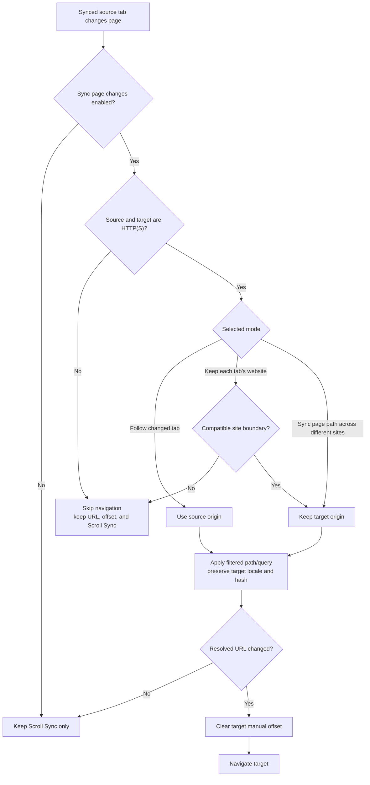

# URL Sync 수동 테스트 가이드

이 문서는 URL Sync의 세 모드가 사용자에게 보이는 설명과 실제 navigation 정책을 일치시키는지
Chromium 계열 브라우저에서 확인하는 절차입니다. URL resolver, URL Sync 설정 UI, storage repair,
content-script navigation, manual offset 처리 중 하나라도 변경했다면 이 가이드를 사용하세요.

## 테스트 대상 빌드

Production Chromium artifact를 생성하고 staging 폴더가 아닌 안정 경로를 load unpacked 합니다.

```bash
pnpm build
pnpm build-firefox # Firefox도 확인할 때
```

- Chrome/Brave/Arc: `build/chromium/`
- Firefox: `build/firefox/`
- `extension/`은 여러 browser build가 공유하는 staging 폴더이므로 production 수동 QA에 직접
  로드하지 않습니다.

Arc에서는 `arc://extensions`를 열고 Developer Mode를 활성화한 뒤 `build/chromium/`을
Load unpacked 합니다. Arc가 extension command의 물리 단축키를 background에 전달하지 않는
경우가 있으므로 URL Sync QA는 popup의 tab selection과 **Start synchronization**을 사용합니다.

## 모드별 사용자 계약

| 모드                                      | Navigation 후 target origin | Site-boundary 검사     | 차단 시 동작                                 |
| ----------------------------------------- | --------------------------- | ---------------------- | -------------------------------------------- |
| **Follow changed tab**                    | source origin으로 변경      | 사용하지 않음          | invalid HTTP(S) URL만 차단                   |
| **Keep each tab's website**               | target origin 유지          | 호환되는 pair만 허용   | URL/offset 유지, Scroll Sync 계속            |
| **Sync page path across different sites** | target origin 유지          | 명시적 opt-in으로 생략 | invalid HTTP(S) URL은 차단, Scroll Sync 계속 |

세 모드 모두 target의 locale carrier와 hash를 가능한 한 유지합니다. Source hash는 복사하지
않습니다. Query는 raw 전체 복사가 아니라 기존 identity-query filtering을 거치지만 allowlist는
아니므로, 수동 QA에는 token이나 사용자 데이터 대신 `tab=pricing`, `view=details`처럼 무해한
값만 사용하세요.

## Navigation 결정 흐름



## 재현 가능한 로컬 fixture

아래 명령은 모든 path에 응답하고 스크롤 가능한 서로 다른 두 origin을 만듭니다.

```bash
node -e 'const http=require("node:http"); const start=(port,host,name)=>http.createServer((req,res)=>{res.writeHead(200,{"content-type":"text/html; charset=utf-8"});res.end(`<!doctype html><meta charset="utf-8"><title>${name}</title><style>body{min-height:4000px;font:16px sans-serif}</style><h1>${name}</h1><p>${req.url}</p>`)}).listen(port,host); start(3000,"127.0.0.1","Dev Fixture"); start(3001,"::","Target Fixture");'
```

초기 탭:

```text
Source: http://127.0.0.1:3000/en/home?view=compact#source-home
Target: http://localhost:3001/ko/home?view=compact#target-home
```

`127.0.0.1`과 `localhost`는 unrelated site boundary로 취급됩니다.

## 핵심 수동 시나리오

### 1. 새 모드 UI와 persistence

1. Popup에서 **Sync page changes**를 켭니다.
2. **Sync page path across different sites**를 선택합니다.
3. “Path and query data may be sent to another site” 경고가 선택 상태와 함께 보이는지 확인합니다.
4. Popup을 닫고 다시 열어 선택한 모드가 그대로인지 확인합니다.
5. 동기화 중 content panel도 같은 실제 모드와 경고를 표시하는지 확인합니다.

Storage read/write/repair가 실패한 경우 UI는 요청한 모드를 성공한 것처럼 표시하면 안 됩니다.
실제 persisted mode를 유지하고 actionable notice를 보여야 합니다.

### 2. Unrelated-origin navigation

두 fixture 탭을 선택해 동기화를 시작하고 Source를 다음 URL로 이동합니다.

```text
http://127.0.0.1:3000/en/about?tab=pricing&utm_source=mail#source-section
```

Target 예상 URL:

```text
http://localhost:3001/ko/about?tab=pricing#target-home
```

확인 항목:

- target protocol, hostname, port가 `http://localhost:3001`로 유지됩니다.
- source path의 locale segment 대신 target locale `/ko/`가 유지됩니다.
- `tab=pricing`은 적용되고 `utm_source`는 제거됩니다.
- target hash `#target-home`이 유지되고 source hash는 복사되지 않습니다.
- navigation 후에도 두 탭의 Scroll Sync가 계속 동작합니다.

Target에서 반대 방향으로 page를 변경해도 Dev tab이 자기 origin을 유지해야 합니다.

### 3. 기존 보수적 모드

같은 fixture pair에서 **Keep each tab's website**를 선택하고 Source path를 변경합니다.

- Target URL과 target manual offset은 변경되지 않아야 합니다.
- Incompatible-site notice가 표시되어야 합니다.
- Source를 스크롤하면 Target은 기존 offset을 사용해 계속 따라가야 합니다.

### 4. 기존 follow 모드와 URL Sync off

- **Follow changed tab**에서는 unrelated target도 source origin으로 이동해야 합니다.
- **Sync page changes**를 끄면 target navigation만 멈추고 Scroll Sync는 유지되어야 합니다.

### 5. Invalid/non-HTTP(S) target

확장 상세 화면에서 **Allow access to file URLs**를 켜고 긴 Markdown 또는 HTML `file://` 탭을
fixture와 manual sync 합니다. HTTP fixture를 다른 path로 이동했을 때 file 탭은 이동하지 않고,
기존 URL/manual offset과 Scroll Sync를 유지해야 합니다.

## 실제 환경 acceptance matrix

아래 hostname은 고정된 sanitized 예시입니다. 실제 QA에서는 해당 환경의 실제 host로 바꾸되,
query에는 민감한 값을 넣지 마세요.

| Source navigation                                                     | Target before                                     | Target after                                            |
| --------------------------------------------------------------------- | ------------------------------------------------- | ------------------------------------------------------- |
| `http://localhost:3000/product2?view=details&utm_source=mail#source`  | `https://company.cz/product1?view=summary#target` | `https://company.cz/product2?view=details#target`       |
| `https://company.cz/product2?view=details#source`                     | `http://localhost:3000/product1#target`           | `http://localhost:3000/product2?view=details#target`    |
| `https://test1.company.cloudprovider.cz/product2?tab=specs`           | `https://company.cz/product1#production`          | `https://company.cz/product2?tab=specs#production`      |
| `https://test1.ua.company.cloudprovider.cz/product2?tab=specs`        | `https://company.com.ua/product1#market`          | `https://company.com.ua/product2?tab=specs#market`      |
| `https://company.cz/product2?lang=en&page=2&utm_campaign=mail#source` | `https://company.com.ua/product1?lang=uk#target`  | `https://company.com.ua/product2?page=2&lang=uk#target` |

Origin마다 source/target 방향을 바꿔 한 번씩 더 실행합니다.

## 완료 체크리스트

- [ ] 세 모드의 label, description, warning이 실제 runtime 동작과 일치한다.
- [ ] 새 모드는 target protocol, hostname, port, locale carrier, hash를 유지한다.
- [ ] 관련 source query만 기존 filtering 정책을 거쳐 적용되고 tracking query는 제거된다.
- [ ] Source hash는 복사되지 않는다.
- [ ] 기존 keep-website 모드는 unrelated boundary를 계속 차단한다.
- [ ] Invalid, blocked, same-URL 결과는 target URL/manual offset을 변경하지 않는다.
- [ ] 성공한 navigation만 target manual offset을 지운다.
- [ ] Navigation 성공/차단과 관계없이 Scroll Sync session과 relay identity가 유지된다.
- [ ] Popup과 content panel이 persisted mode 및 실패 notice를 동일하게 표시한다.
- [ ] Runtime notice/log에 raw URL, title, path, query, hash가 노출되지 않는다.
